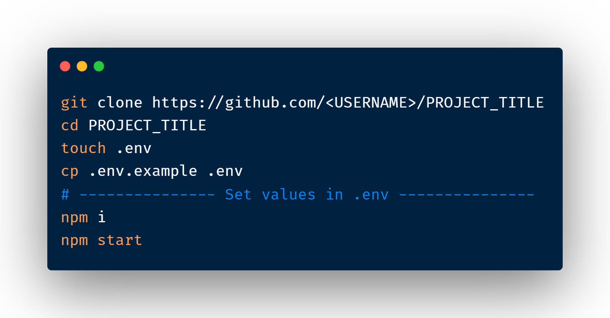

# PROJECT_TITLE

  

---

## PROJECT_DESCIPTION

### Features

- Protected URLs using OAuth
- feature 1
- feature 2

### Technologies Used

- Node.js + Express.js
- MongoDB

## Setup

### Made with ❤️️ by [NAME](<PROFILE-URL>)